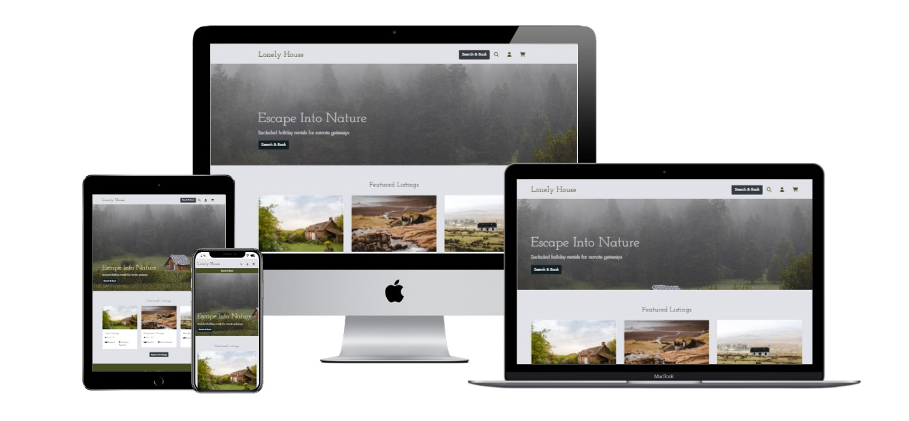
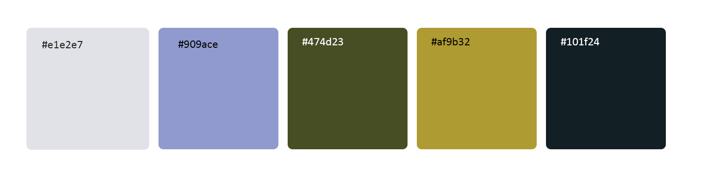
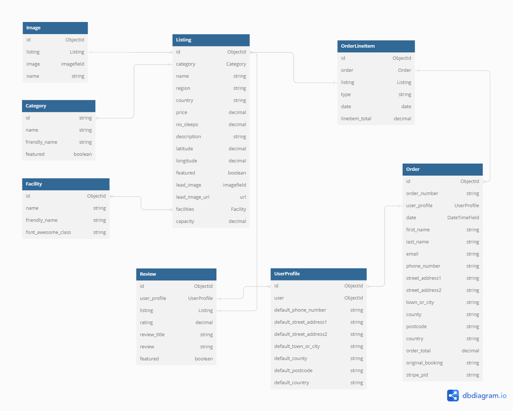

# Lonely House

## Milestone Project 4 - Full Stack Development

<h2 align="center"></h2>

* Lonely House is a fictional holiday letting website that allows users to browse and book holiday lettings.

* This is my Milestone Project 4 submission for Code Institute's Diploma in Web Application Development course. Lonely House is built using Django full stack framework and uses a Relational Database. Technologies used include HTML, CSS, Javascript, Python, Google Maps API and Stripe payments.

* Key features include:
  - Filters: Users can apply filters to quickly and easily find options
  - Real-time Availability: Users can browse and select available dates (unavailable dates from exisiting bookings will be disabled).
  - Cart & Stripe Checkout: Users can add multiple bookings to their cart and proceed to checkout with Stripe.
  - User Profile : Users can create an account to save their contact information and view their order history
  - Reviews: Registered users can create, read, update and delete reviews

## Live Project

[View the live project here.](https://lonely-house.herokuapp.com/)

## Repository

[Find the project repository here.](https://github.com/Isabella-Mitchell/lonely-house)

# Table of Contents

## Contents
- [User experience](#user-experience)
  * [User Stories](#user-stories)
    + [First-time Users](#first-time-users)
    + [Returning Users](#returning-users)
    + [Business Owner](#business-owner)
- [Design](#design)
  + [Overview](#overview)
  + [Colour Scheme](#colour-scheme)
  + [Typography](#typography)
  + [Imagery and Aesthetics](#imagery-and-aesthetics)
  + [Icons](#icons)
  + [Cards](#cards)
- [Wireframes](#wireframes)
- [Features](#features)
- [Future Features](#future-features)
  + [User Experience Features](#user-experience-features)
  + [Development Features](#development-features)
- [Data Model](#data-model)
- [Technologies used](#technologies-used)
  + [Languages Used](#languages-used)
  + [Frameworks Libraries and Programs](#frameworks-libraries-and-programs)
- [Testing](#testing)
- [Deployment](#deployment)
  + [Creating a Gitpod Workspace](#creating-a-gitpod-workspace)
  + [GitHub Pages](#github-pages)
  + [Forking the GitHub Repository](#forking-the-github-repository)
  + [Making a Local Clone](#making-a-local-clone)
  + [Creating an application with Heroku](#creating-an-application-with-heroku)
- [Credits](#credits)
  + [Code](#code)
  + [Media](#media)
  + [Content](#content)
  + [Acknowledgements](#acknowledgements)

# User Experience

## User stoires

| User Story ID | As a/an | I want to be able to... | So that I can... |
| --- | ----------- | ----------- | ----------- |
 | Viewing and Navigation | 
| 1 | Customer | View a list of accomodation | Quickly compare and select different accomodation options | 
 | 2 | Customer | View individually accomodation details | Find out further information about and see further images of the listing | 
 | 3 | Customer | See an embedded google maps map | Plan my journey to the site from my location | 
 | 4 | Customer | Quickly identify key features of accomodation through icons and keywords | Decide if it's appropriate for type of stay I want | 
 | 5 | Customer | See the  price update automatically when I enter my stay length | To help me not overspend | 
 | 6 | Customer | See available dates | Know I'll have the cabin when I book it due to a responsive date picker | 
 | 7 | Customer | See ratings and reviews | To help me make my desision | 
 | Registration and User Accounts | 
 | 8 | Site User | Easily register for an account | Have a personal account and be able to see my profile | 
 | 9 | Site User | Easily login or logout | Access my personal info | 
 | 10 | Site User | Easily recover my password | Access my account even if I've forgotten my password | 
 | 11 | Site User | Recieve an email confirmation after registering | Verify that my email was correctly entered | 
 | 12 | Site User | Have a personalised user profile | With my personal order history and be able to update my default billing address | 
 | 13 | Site User | Be able to make an account after checkout | To be able to see my booking if I haven't made one before | 
 | 14 | Site User | Make an account to leave ratings and reviews | Comment on my stay and help others make a choice | 
 | 15 | Site User | See my ratings and reviews in my user profile | So I can see what reviews/ ratings I have left easily | 
 | Sorting and Searching | 
 | 16 | Customer | Sort/ Filter listings by dedicated filters. e.g. number of people | Easily identify suitable options with features I want for my stay | 
 | 17 | Customer | Be able to edit my filters even after page refresh | To make it quicker and easier to apply filters | 
 | 18 | Customer | Search for a product by name, description or key feature | Find a specific accomodation I'd like to book | 
 | 19 | Customer | Easily see what I've searched for and the number of results | Be able to see which options match my search | 
 | 20 | Customer | See if there are no search results | Quickly see there is nothing that matches my search | 
 | Purchasing and Checkout | 
 | 21 | Customer | Be able to select the stay I want and book through the product page | Start the booking process | 
 | 22 | Customer | Be able to review my cart and add multiple bookings | So I don't have to go through the checkout process multiple times, or go to checkout before I am ready | 
 | 23 | Customer | Be able to review my order details | So I can double check I have booked the right accomodation for the right dates with the right number of people | 
 | 24 | Customer | Easily enter my payment information | Check out quickly with no hassles | 
 | 25 | Customer | Feel my personal and payment information is safe and secure | Confidently provide the needed information to make a purchase | 
 | 26 | Customer | View an order confirmation after checkout | Know my order has gone throigh and I haven't made any mistakes | 
 | 27 | Customer | Recieve an email confirmation after checkout | Keep a confirmation for my records | 
 | Landing Page | 
 | 28 | Store Owner | Showcase featured listingd | Give website visitors a quick sense of the types of listings available on my website | 
 | 29 | Store Owner | Showcase featured categories | Give website visitors a quick sense of the types of categories available on my website | 
 | 30 | Store Owner | Showcase featured reviews | Show social proof and build trust with websitevisitors | 
 | Ratings & Reviews | 
 | 31 | Customer | To be able to add a Rating/ Review | In case I wish to add a rating and or a written review | 
 | 32 | Customer | To be abl to delete a Rating/ Review | In case I wish to delete a rating and or a written review | 
 | 33 | Customer | to be able to edit a Rating/ Review | In case I wish to edit a rating and or a written review | 

## Design

### Overview

- The website design is simple yet characterful. As the name 'Lonely House' suggests, the website's USP is that it offers holiday lettings that are remote and situated in nature. They offer a chance for people to escape busy lives, relax in nature and slow down. The aesthic of the website, with its soft edges and rounded corners, warm colours and rich visual references to nature, was inspired by this idea.

### Colour

- Lonely House uses a limited colour scheme of warm creams, greys and greens. Inspiration for the colour scene came from nature and imagery I sourced in preparation for the project.

- I used the Material Design Colour Tool to help me decide on colour choices. I used the [WebAim Contrast Checker](https://webaim.org/resources/contrastchecker/) to ensure my colour choices had a high enough colour ratio.

<h2 align="center"></h2>

### Typography

- Headings are in Josefin Slab, with serif as a fallback font. With slight typewritier style attributes, Josefin Slab brings a subtle sense of character to the website. The body copy is in Jost with sans-serif as a fallback font. The choice of simple, easily-legible typefaces means that the text will be easy to read on all device sizes. 

### Imagery 

- Imagery is a very important feature of the website, as users need to be able to see listings to be encouraged to book a holiday.

- Images are mostly displayed in Bootstrap Carousels. These allows the admin to add multiple photos without worrying about them taking up lots of space on the page.

- The admin can choose to set a featured image. This the image that appears first by default on the all listings and listing detail page. There is a fallback 'holding' image if the admin does not set an image.

- Consistent aspect ratios have been used to bring visual harmony to the site across different page layouts.

### Icons

- I used icons from Font Awesome extensively on the website. They are used within the nav bar to reduce the need for verbose descriptions such as 'search. I have used them on buttons to reinforce the action of the button. They are also used within listings to visually represent different facilities, ratings, location pin etc. I have added in screen reader alteratives where I felt it was necessary and appropriate.

### Cards

- I have used Bootstrap cards to visually organise content. These include content that appears as multiples on a page such as listings and reviews. I have also used single cards as containers for content such as the cart, checkout form and checkout confirmation.

# Wireframes

- [View my wireframes in PDF form here](#docs/README/wireframes/wireframes.pdf).

## Changes to Wireframes

Due to time constraints and descions made during the project, there are some differences between the live site and my initial wireframes

- Added add/edit/delete reviews page within the User Profile
  * I initially was going to add the review CRUD functionality to the listing page. But during the project I realised it may be more intiutative for users to be able to see all their reviews in one place, instead of scattered on different pages.

- Added Cart step and cart button to nav
  * Originally I wasn't planning on adding a cart step, as many of the holiday letting websites I looked at for research did not have one. However my mentor suggested it would be a good idea as additional 'add-ons' such as insurance and car rental could be introduced as a future feature.

- Added 'Search and Book' button to nav and as a banner on smaller screen sizes
  * As I was building the website, I realised it wasn't very easy for users to get to the 'all listings' page. I therefore added a button to the navigation making it easier and more intuiative for users to browse listings.

- Didn't include map view on listing page
  * I set coordinates for listings and made it a required field so that I could show a google map on each listing page, and also let users see a map view of all listings. However, due to time contraists I was not able to releaise the latter feature.

- Didn't add back to top button at bottom of pages
  * This feature wasn't a prioirty during development, so I omitted it due to time contraists. However in reality the all listings page would need some way to manage a lot of listings, whether that's infinite scroll or pagination.

# Summary of Features

## All Pages

- Resonsive design
- Semantic HTML
- Custom CSS to give the website a cohesive and user-friendly appearance

### Header & Navigation

- Website H1 Heading
- Navigation, including links to:
  - Search & Book (all listings page)
  - Search (search bar)
  - User Profile Options (register/ login/ view profile/ view reviews)
  - Cart (changes colour if cart is not empty)

### Footer

- About
- Social Links 

### Messages

- Success message (including cart link when applicable)
- Info message
- Error message
- Warning message

## Homepage

- Jumbotron
- Featured Listings
- Featured Categories
- Featured Reviews
- 'Call to action' buttons

## All Listings Page

- Splash Image
- Filters, featuring:
  - Collapse on smaller screens
  - Checkbox dropdown
  - Applied filters shown to user
  - Ability for user to edit applied filters even after page refresh
  - Shown listing count
  - Reset filters button
- Listing Cards, featuring:
  - Featured Image or Fallback Image
  - Image carousel if multiple images
  - Facility tooltips
  - Average Rating
  - Book button

## Listing Detail Page
  - Featured Image or Fallback Image
  - Image carousel if multiple images
  - Date range picker, featuring:
    - Greys out unavailable dates
    - Check availability button
    - Messages if user selects invalid dates
    - If dates are valid, total price is shown to user
    - Book now button (adds to cart)
  - Key features
  - Description with line breaks
  - Location
  - Google Maps API
  - Reviews
  - Average rating

## Cart Page
- Booking details for each listing added to cart, featuring:
  - Checkout date is not counted as a night
  - Confirmation of dates selected
  - Subtotal
- Remove from cart option
- Cart Total
- Secture Checkout button
- Back button

## Checkout Page
- Order summary
- Checkout form, featuring:
  - Option to save information to profile
  - Autopopulates with content saved to user profile
  - Stripe payment

## Checkout Confirmation Page/ Email
- Checkout confirmation page
- Sends booking confirmation email

## Authetification Pages
- Register/ Log In/ Log Out/ Reset Password Pages
- Features largely provided by Django allauth

## User Profile Page
- Default information form
- Order history
- Users must be logged in
- Users can only access their own User Profile

## Reviews Pages
- Users can view all their reviews
- Users must be logged in
- Users can only access their own reviews

## Add/ Edit/ Delete Reviews
- Add Review Page
- Edit Review Page
- Delete Review
- Users must be logged in
- Users can only access their own reviews

# Key Features

I have gone into more detail about some the key ...

# Future Features

- The Javascript For example, I use maths to calulcate the number of nights. I could simply count how many items appear in the array of dates selected by the user. 

If a user returns to a listing page from the cart, they do not have a clever way to amend their booking. I have not added this yet due to time constraints. It is down as a future feature. 

TO FINISH

## User Experience Features 

### All Pages

- 

## Development Features

### Testing

- JQuery/ Jest
- More tests for checkout

# Data Model

## Planning & Considerations

As outlined in my ...

TO DO FINISH

## Database Schema

The following Data models were used:

- Listings - stores information for each holiday let
- Category - stores information about Listing category
- Facility - stores information about Listing facilities
- Image - stores multiple images for listings
- Order - stores order information
- OrderLineItem - stores booking information (one is created for each date)
- UserProfile - stores user information (relates to Django Allauth User model, not included in this schema)
- Review - stores rating and review information

This diagram outlines each model's fields and illustrates the relationship between the models:

<h2 align="center"></h2>

# Technologies Used

## Languages Used

- [HTML5](https://en.wikipedia.org/wiki/HTML5)

- [CSS3](https://en.wikipedia.org/wiki/CSS)

- [JavaScript](https://en.wikipedia.org/wiki/JavaScript)

- [Python](https://en.wikipedia.org/wiki/Python_(programming_language))

## Frameworks & Libraries

- [Django](https://www.djangoproject.com/)
  - This website is built using Django, a high-level Python web framwork.. Lonely House features multiple apps with model, view and template layers. I have also used Django to provide an admin view, create forms and test my website. Further features used include [Django Allauth](https://django-allauth.readthedocs.io/en/latest/index.html) for user authentification, Pillow for uploading images, and Crispy Forms.

- [Jinja](https://jinja.palletsprojects.com/en/3.0.x/)
  - Templating language I've used with Python to add logic to my html templates.

- [jQuery](https://jquery.com/)
  - I used jQuery to add functionality to MaterialiseCSS componants.

- [Bootstrap 4](https://getbootstrap.com/) 
  - I used bootstrap throughout the site to make it responsive. The website uses Bootstrap's Containers, Grid System, Flexbox and Spacing utilities. I sourced code from the Bootstrap documentation when building the Navbar, Image Carousels, Cards and Buttons.

- [Google Fonts](https://fonts.google.com/)
  - Two fonts are imported from google fonts.
  
- [Font awesome](https://fontawesome.com/)
  - I used icons from font awesome on buttons.

- [Bootstrap Date Picker](https://bootstrap-datepicker.readthedocs.io/en/latest/index.html)
  - I used this CDN to provide the date range picker on the listing detail page.

## Storage & Hosting

- [Heroku](https://id.heroku.com/login)
  - Heroku is the deployment source I used for this project. I'm also using it for the Postgres relational database

- [Github](https://github.com/)
  - Github was used to create and store the project repository.

- [Amazon Web Services](https://aws.amazon.com/)
  - AWS is used to host and store static files and media.

- [ElephantSQL](https://www.elephantsql.com/)
  - ElephantSQL is used to host the website's PostgreSQL database.

## Payments

- [Stripe](https://stripe.com/gb)
  - Stripe is used to handle website payments.

## Application Programming Interface (API's)

- [Google Maps Geocoding API](https://developers.google.com/maps/documentation/geocoding)
    - I used Google's Geocoding API to turn the provided address into coordinates.

## IDE & Version Control

- [Git](https://git-scm.com/)
  - Git was used as a version control in the terminal.

- [Gitpod](https://gitpod.io/)
  - Gitpod was used to create my files and where I wrote the code.

## Other Tools

- [Balsamiq](https://balsamiq.com/)
  - Balsamiq was used to create Wireframes for the project during the initial planning stage.

- [Techsini](https://techsini.com/multi-mockup/)
  - Techsini was used to help check responsiveness and take screenshots of the page at different screen sizes.

- [Adobe Photoshop](https://www.adobe.com/ie/products/photoshop.html)
  - Photoshop was used to resize images for the website.

- [TinyPNG](https://tinypng.com/)
  - TinyPNG was used to compress images for a faster loading time.

- [WebFormatter](https://webformatter.com/html)
  - WebFormatter was used to help beautify the code.

- [Google Chrome Dev Tools](https://developer.chrome.com/docs/devtools/)
  - Google Chrome's Dev Tools were used while building the project to test responsiveness and for debugging.

- [dbdiagram](https://dbdiagram.io/)
  - Tool used to mock up database structure diagram.

- [Unsplash](https://unsplash.com/)
  - Unsplash was used to source the website imagery.

- [ChatGPT](https://openai.com/blog/chatgpt/)
  - OpenAI's ChatGPT was used in part to generate Listing Descriptions and user Reviews.

## Testing & Code Validation

Lighthouse (provided by Google Dev Tools)
W3C Validator (to check validity of HTML and CSS)
JSHint.com (to check JavaScript)
PEP8 Linting on Gitpod (to check Python code for PEP 8 requirements)
Coverage
A11y Tools
Chrome screen reader

TO DO FINISH

# Testing

- Please refer [here](docs/README/TESTING.md) for more information on testing of the Lonely House website

# Deployment

- Please refer [here](docs/README/DEPLOYMENT.md) for more information on the deployment of the Lonely House website

# Credits

## Code

- Bootstrap

- Code Institute:

- Stack Overflow: 

- W3Schools: 

- Geekflare: 

- Documentation:

## Content

- 

## Media

- As I sourced all the imagery for the Lonely House website from Unsplash, there is an extensive list of media credits.

- Please refer [here](docs/README/CREDITS.md) for full Media credits for the Lonely House website.

## Acknowledgements

- Thank you to my Mentor Akshat Garg for helpful feedback, industry insights and recommended tools.

- Thank you to ... for participating in the peer code review on the Code Institute Slack channel. Thank you to my family for manually testing the website and for feedback.

- Thank you to the Code Institute London Community for their encouragement and technical support.

- Thank you to the tutors and staff at Code Institute for their support.

- Thank you to Ben Smith and Pasquale Fasulo at City of Bristol College for their support.

Please note this is a personal project. This website is purely for the sake of the developer's portfolio and not for public consumption.

Isabella Mitchell, 2022.