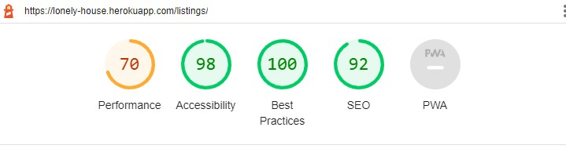

# Testing

The Gather recipe website has been tested using the following methods:
- [Code Validation](#code-validation)
    - [W3C HTML Validator](#w3c-html-validator) 
    - [W3C CSS Validator](#w3c-css-validator)
    - [JSHINT Javascript Code Quality Tool](#jshint-javascript-code-quality-tool)
    - [Python Validation using Gitpod](python-validation-using-gitpod)
- [A11y Color Contrast Accessibility Checker](#a11y-color-contrast-accessibility-checker)
- [Wave Webaim Accessibility Checker](#wave-webaim-accessibility-checker)
- [Lighthouse](#lighthouse)
- [Responsiveness](#responsiveness)
- [Browser Compatibility](#browser-compatibility)
- [Testing User Stories](#testing-user-stories)
    - [First Time User](#first-time-user)
    - [Returning User](#returning-user)
    - [Business Owner](#business-owner)
- [Manual Testing](#manual-testing)
- [Automated Testing](#automated-testing)
- [Peer Review](#peer-review)
- [Bugs](#bugs)
    - [Resolved](#resolved)
    - [Unresolved](#unresolved)

# Code Validation

## W3C HTML Validator

The Lonely House website landing page passed all tests using the W3C HTML Validator tool

Via URL

<h2 align="center"></h2>

<h2 align="center"></h2>

<h2 align="center"></h2>

<h2 align="center"></h2>

<h2 align="center"></h2>

<h2 align="center"></h2>

<h2 align="center"></h2>

<h2 align="center"></h2>

Direct Input (Logged In View)

<h2 align="center"></h2>

<h2 align="center"></h2>

<h2 align="center"></h2>

<h2 align="center"></h2>

<h2 align="center"></h2>

## W3C CSS Validator

The Lonely House website passed all tests using the W3C CSS Validator tool

<h2 align="center"></h2>

<h2 align="center"></h2>

<h2 align="center"></h2>

## JSHINT Javascript Code Quality Tool

The Lonely House website passed all tests using the JSHint Validator tool

<h2 align="center"></h2>

<h2 align="center"></h2>

<h2 align="center"></h2>

<h2 align="center"></h2>

<h2 align="center"></h2>

There was an issue highlighted by JSHint. i believe it's because I am using a template literal within a jQuery selector. However, as the code performs as I desire it to, and if I use quotes then it does not work, I have decided not to change it.

<h2 align="center"></h2>

## Python Validation using Gitpod

I have checked all Python documents using a PEP8 linter to ensure they are complient.

Exceptions include code I have not written in Django settings.

# A11y Color Contrast Accessibility Checker

# Wave Webaim Accessibility Checker

# Lighthouse

I used the Lighthouse reports in Google Developer Tools to examine the pages of the website for the following
- Performace
- Accessibility
- Best Practices 
- SEO

There were some less than optimum scores for perfomrmance and SEO. These could be resolved by:
- Using next gen image formats
- Reducing unused Javascript and jQuery
- Adding metadata to listing detail pages

## Homepage

<h2 align="center"></h2>

<h2 align="center"></h2>

## All Listings

<h2 align="center"></h2>

<h2 align="center"></h2>

## Listing Details

<h2 align="center"></h2>

<h2 align="center"></h2>

# Browser Compatibility

# Responsiveness

Responsivity tests were carried out using Google Chrome DevTools. Device screen sizes covered include:
- iPhone SE
- iPhone XR
- iPhone 12 Pro
- Pixel 5
- Samsung Galaxy S8+
- Samsung Galaxy S20 Ultra
- iPad Mini
- iPad Air
- Surface Pro 7
- Surface Duo
- Galaxy Fold
- Samsung Galaxy A51/71
- Nest Hub
- Nest Hub Max

I also personally tested the website on iPhone 11, iPad Pro 2nd Generation, Dell XPS 15 laptop and a Dell widescreen monitor.

# Testing User Stories

| User Story ID | As a/an | I want to be able to... | So that I can... | Achieved on... |
| --- | ----------- | ----------- | ----------- | ----------- |
 | Viewing and Navigation | 
 | 1 | Customer | View a list of accomodation | Quickly compare and select different accomodation options | All Listings Page | 
 | 2 | Customer | View individually accomodation details | Find out further information about and see further images of the listing | Listings Details Pages | 
 | 3 | Customer | See an embedded google maps map | Plan my journey to the site from my location | Listings Details Pages | 
 | 4 | Customer | Quickly identify key features of accomodation through icons and keywords | Decide if it's appropriate for type of stay I want | All Listings Page and Listings Details Pages | 
 | 5 | Customer | See the  price update automatically when I enter my stay length | To help me not overspend | Listings Details Pages | 
 | 6 | Customer | See available dates | Know I'll have the cabin when I book it due to a responsive date picker | Listings Details Pages | 
 | 7 | Customer | See ratings and reviews | To help me make my desision | Listings Details Pages | 
 | Registration and User Accounts | 
 | 8 | Site User | Easily register for an account | Have a personal account and be able to see my profile | Register Page | 
 | 9 | Site User | Easily login or logout | Access my personal info | Log in and Log out Pages | 
 | 10 | Site User | Easily recover my password | Access my account even if I've forgotten my password | Reset Password Page & Reset Password Email | 
 | 11 | Site User | Easily access my user profile | Access my account quickly | Navigation (all pages) | 
 | 12 | Site User | Have a personalised user profile | With my personal order history and be able to update my default billing address | User Profile Page | 
 | 13 | Site User | Be able to make an account after checkout | To be able to see my booking if I haven't made one before | Checkout Page | 
 | 14 | Site User | Make an account to leave ratings and reviews | Comment on my stay and help others make a choice | Reviews Page | 
 | 15 | Site User | See my ratings and reviews in my user profile | So I can see what reviews/ ratings I have left easily | Reviews Page | 
 | Sorting and Searching | 
 | 16 | Customer | Sort/ Filter listings by dedicated filters. e.g. number of people | Easily identify suitable options with features I want for my stay | All Listings Page | 
 | 17 | Customer | Be able to edit my filters even after page refresh | To make it quicker and easier to apply filters | All Listings Page | 
 | 18 | Customer | Search for a product by name, description or key feature | Find a specific accomodation I'd like to book | All Listings Page | 
 | 19 | Customer | Easily see what I've searched for and the number of results | Be able to see which options match my search | All Listings Page | 
 | 20 | Customer | See if there are no search results | Quickly see there is nothing that matches my search | All Listings Page | 
 | Purchasing and Checkout | 
 | 21 | Customer | Be able to select the stay I want and book through the product page | Start the booking process | Listings Details Pages | 
 | 22 | Customer | Be able to review my cart and add multiple bookings | So I don't have to go through the checkout process multiple times, or go to checkout before I am ready | Cart Page | 
 | 23 | Customer | Be able to review my order details | So I can double check I have booked the right accomodation for the right dates with the right number of people | Cart Page and Checkout Page | 
 | 24 | Customer | Easily enter my payment information | Check out quickly with no hassles | Checkout Page | 
 | 25 | Customer | Feel my personal and payment information is safe and secure | Confidently provide the needed information to make a purchase | Checkout Page | 
 | 26 | Customer | View an order confirmation after checkout | Know my order has gone throigh and I haven't made any mistakes | Order Confirmation Page | 
 | 27 | Customer | Recieve an email confirmation after checkout | Keep a confirmation for my records | FAIL - Unresolved Bug | 
 | Landing Page | 
 | 28 | Store Owner | Showcase featured listing | Give website visitors a quick sense of the types of listings available on my website | Homepage | 
 | 29 | Store Owner | Showcase featured categories | Give website visitors a quick sense of the types of categories available on my website | Homepage | 
 | 30 | Store Owner | Showcase featured reviews | Show social proof and build trust with websitevisitors | Homepage | 
 | Ratings & Reviews | 
 | 31 | Customer | To be able to add a Rating/ Review | In case I wish to add a rating and or a written review | Add Reviews Page | 
 | 32 | Customer | To be abl to delete a Rating/ Review | In case I wish to delete a rating and or a written review | Reviews Page | 
 | 33 | Customer | to be able to edit a Rating/ Review | In case I wish to edit a rating and or a written review | Edit Reviews Page | 

# Automated Testing

* I have written a suite of automated tests in Django using Python unittest framework. These cover views, forms and models where applicable. Tests can be found in tests.py files within the apps.

* Due to time contraints, there are some parts of my project which are not covered by automated tests. However I feel the testing is sufficient in conjunction with manual testing.

* Due to time constraints and the use of jQuery via a CDN, I have not written tests for my javascript. This is a future development feature.

## All tests passing

* In total I wrote 44 tests. They all passed.

<h2 align="center"></h2>

## Coverage

* I have used coverage to calculate the percentage of my code which is covered by unittests. The result is 85%.

* You can see a breakdown by app in [PDF form here](TESTING/Coverage-report.pdf).

<h2 align="center"></h2>

# Manual Testing

# Peer Review

# Bugs

## Resolved

## Unresolved

Back to [README.md](/README.md#testing)