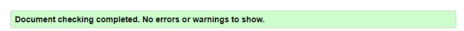
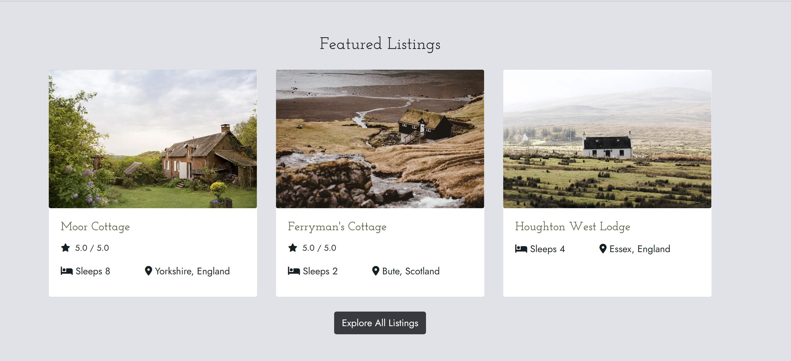
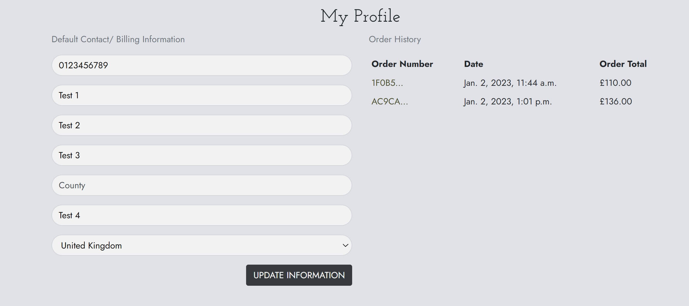

# Testing

The Gather recipe website has been tested using the following methods:
- [Code Validation](#code-validation)
    - [W3C HTML Validator](#w3c-html-validator) 
    - [W3C CSS Validator](#w3c-css-validator)
    - [JSHINT Javascript Code Quality Tool](#jshint-javascript-code-quality-tool)
    - [Python Validation using Gitpod](python-validation-using-gitpod)
- [Accessibility](#accessibility)
    - [Colour Contrast](#colour-contrast)
    - [Wave Webaim Accessibility Checker](#wave-webaim-accessibility-checker)
- [Lighthouse](#lighthouse)
- [Responsiveness](#responsiveness)
- [Browser Compatibility](#browser-compatibility)
- [Testing User Stories](#testing-user-stories)
    - [First Time User](#first-time-user)
    - [Returning User](#returning-user)
    - [Business Owner](#business-owner)
- [Manual Testing](#manual-testing)
- [Automated Testing](#automated-testing)
- [Peer Review](#peer-review)
- [Bugs](#bugs)
    - [Resolved](#resolved)
    - [Unresolved](#unresolved)

# Code Validation

## W3C HTML Validator

The Lonely House website landing page passed all tests using the W3C HTML Validator tool

Via URL

<h2 align="center"></h2>

<h2 align="center"></h2>

<h2 align="center"></h2>

<h2 align="center"></h2>

<h2 align="center"></h2>

<h2 align="center"></h2>

<h2 align="center"></h2>

<h2 align="center"></h2>

Direct Input (Logged In View)

<h2 align="center"></h2>

<h2 align="center"></h2>

<h2 align="center"></h2>

<h2 align="center"></h2>

<h2 align="center"></h2>

## W3C CSS Validator

The Lonely House website passed all tests using the W3C CSS Validator tool

<h2 align="center"></h2>

<h2 align="center"></h2>

<h2 align="center"></h2>

## JSHINT Javascript Code Quality Tool

The Lonely House website passed all tests using the JSHint Validator tool

<h2 align="center"></h2>

<h2 align="center"></h2>

<h2 align="center"></h2>

<h2 align="center"></h2>

<h2 align="center"></h2>

* There was an issue highlighted by JSHint. i believe it's because I am using a template literal within a jQuery selector. However, as the code performs as I desire it to, and if I use quotes then it does not work, I have decided not to change it.

<h2 align="center"></h2>

## Python Validation using Gitpod

* I have checked all Python documents using a PEP8 linter to ensure they are compliant.

* Exceptions include code I have not written in Django settings.

# Accessibility 

## Colour Contrast

* I conducted colour contrast checks to help me decide on an appropriate background colour and text colour. 

<h2 align="center"></h2>

## Wave Webaim Accessibility Checker

* I used WAVE Web Accessibility Evaluation Tools to help me check the A11y compliance of my code. Though there could be further improvements, I made a dedicated effort to ensure my website is accessible.

<h2 align="center"></h2>

<h2 align="center"></h2>

<h2 align="center"></h2>

# Lighthouse

I used the Lighthouse reports in Google Developer Tools to examine the pages of the website for the following
- Performance
- Accessibility
- Best Practices 
- SEO

There were some less than optimum scores for performance and SEO. These could be resolved by:
- Using next gen image formats
- Reducing unused Javascript and jQuery
- Adding metadata to listing detail pages

## Homepage

<h2 align="center"></h2>

<h2 align="center"></h2>

## All Listings

<h2 align="center"></h2>

<h2 align="center"></h2>

## Listing Details

<h2 align="center"></h2>

<h2 align="center"></h2>

# Browser Compatibility

# Responsiveness

Responsivity tests were carried out using Google Chrome DevTools. Device screen sizes covered include:
- iPhone SE
- iPhone XR
- iPhone 12 Pro
- Pixel 5
- Samsung Galaxy S8+
- Samsung Galaxy S20 Ultra
- iPad Mini
- iPad Air
- Surface Pro 7
- Surface Duo
- Galaxy Fold
- Samsung Galaxy A51/71
- Nest Hub
- Nest Hub Max

I also personally tested the website on iPhone 11, iPad Pro 2nd Generation, Dell XPS 15 laptop and a Dell widescreen monitor.

# Testing User Stories

| User Story ID | As a/an | I want to be able to... | So that I can... | Achieved on... |
| --- | ----------- | ----------- | ----------- | ----------- |
 | Viewing and Navigation | 
 | 1 | Customer | View a list of accomodation | Quickly compare and select different accomodation options | All Listings Page | 
 | 2 | Customer | View individually accomodation details | Find out further information about and see further images of the listing | Listings Details Pages | 
 | 3 | Customer | See an embedded google maps map | Plan my journey to the site from my location | Listings Details Pages | 
 | 4 | Customer | Quickly identify key features of accomodation through icons and keywords | Decide if it's appropriate for type of stay I want | All Listings Page and Listings Details Pages | 
 | 5 | Customer | See the  price update automatically when I enter my stay length | To help me not overspend | Listings Details Pages | 
 | 6 | Customer | See available dates | Know I'll have the cabin when I book it due to a responsive date picker | Listings Details Pages | 
 | 7 | Customer | See ratings and reviews | To help me make my decision | Listings Details Pages | 
 | Registration and User Accounts | 
 | 8 | Site User | Easily register for an account | Have a personal account and be able to see my profile | Register Page | 
 | 9 | Site User | Easily login or logout | Access my personal info | Log in and Log out Pages | 
 | 10 | Site User | Easily recover my password | Access my account even if I've forgotten my password | Reset Password Page & Reset Password Email | 
 | 11 | Site User | Easily access my user profile | Access my account quickly | Navigation (all pages) | 
 | 12 | Site User | Have a personalised user profile | With my personal order history and be able to update my default billing address | User Profile Page | 
 | 13 | Site User | Be able to make an account after checkout | To be able to see my booking if I haven't made one before | Checkout Page | 
 | 14 | Site User | Make an account to leave ratings and reviews | Comment on my stay and help others make a choice | Reviews Page | 
 | 15 | Site User | See my ratings and reviews in my user profile | So I can see what reviews/ ratings I have left easily | Reviews Page | 
 | Sorting and Searching | 
 | 16 | Customer | Sort/ Filter listings by dedicated filters. e.g. number of people | Easily identify suitable options with features I want for my stay | All Listings Page | 
 | 17 | Customer | Be able to edit my filters even after page refresh | To make it quicker and easier to apply filters | All Listings Page | 
 | 18 | Customer | Search for a product by name, description or key feature | Find a specific accomodation I'd like to book | All Listings Page | 
 | 19 | Customer | Easily see what I've searched for and the number of results | Be able to see which options match my search | All Listings Page | 
 | 20 | Customer | See if there are no search results | Quickly see there is nothing that matches my search | All Listings Page | 
 | Purchasing and Checkout | 
 | 21 | Customer | Be able to select the stay I want and book through the product page | Start the booking process | Listings Details Pages | 
 | 22 | Customer | Be able to review my cart and add multiple bookings | So I don't have to go through the checkout process multiple times, or go to checkout before I am ready | Cart Page | 
 | 23 | Customer | Be able to review my order details | So I can double check I have booked the right accomodation for the right dates with the right number of people | Cart Page and Checkout Page | 
 | 24 | Customer | Easily enter my payment information | Check out quickly with no hassles | Checkout Page | 
 | 25 | Customer | Feel my personal and payment information is safe and secure | Confidently provide the needed information to make a purchase | Checkout Page | 
 | 26 | Customer | View an order confirmation after checkout | Know my order has gone through and I haven't made any mistakes | Order Confirmation Page | 
 | 27 | Customer | Recieve an email confirmation after checkout | Keep a confirmation for my records | Email | 
 | Landing Page | 
 | 28 | Store Owner | Showcase featured listing | Give website visitors a quick sense of the types of listings available on my website | Homepage | 
 | 29 | Store Owner | Showcase featured categories | Give website visitors a quick sense of the types of categories available on my website | Homepage | 
 | 30 | Store Owner | Showcase featured reviews | Show social proof and build trust with website visitors | Homepage | 
 | Ratings & Reviews | 
 | 31 | Customer | To be able to add a Rating/ Review | In case I wish to add a rating and or a written review | Add Reviews Page | 
 | 32 | Customer | To be able to delete a Rating/ Review | In case I wish to delete a rating and or a written review | Reviews Page | 
 | 33 | Customer | to be able to edit a Rating/ Review | In case I wish to edit a rating and or a written review | Edit Reviews Page | 

# Automated Testing

* I have written a suite of automated tests in Django using Python unittest framework. These cover views, forms and models where applicable. Tests can be found in tests.py files within the apps.

* Due to time constrainsts, there are some parts of my project which are not covered by automated tests. However, I feel the testing is sufficient in conjunction with manual testing.

* Due to time constraints and the use of jQuery via a CDN, I have not written tests for my javascript. This is a future development feature.

* I had to turn off email verification to allow my tests that required log in to work.

## All tests passing

* In total I wrote 44 tests. They all passed.

<h2 align="center"></h2>

## Coverage

* I have used coverage to calculate the percentage of my code which is covered by unittests. The result is 85%.

* You can see a breakdown by app in [PDF form here](TESTING/Coverage-report.pdf).

<h2 align="center"></h2>

# Manual Testing

## Navigation

- The main navigation buttons have been tested and proven to work
- User permissions have been tested and proven to work

<h2 align="center"></h2>

<h2 align="center"></h2>

<h2 align="center"></h2>

## Footer

- Social links in the footer have been tested and proven to work

<h2 align="center"></h2>

## Homepage

- Buttons have been tested and proven to work
- Links have been tested and proven to work

<h2 align="center"></h2>

<h2 align="center"></h2>

<h2 align="center"></h2>

<h2 align="center"></h2>

## All Listings & Filters

- Filters have been tested and proven to work as desired
- Reset Filters button has been tested and proven to work
- Links have been tested and proven to work

<h2 align="center"></h2>

<h2 align="center"></h2>

<h2 align="center"></h2>

<h2 align="center"></h2>

## Search

- Applied search criteria works as expected
- Empty search works as expected

<h2 align="center"></h2>

<h2 align="center"></h2>

## Listing Detail Page

### Image Carousel

- Image carousel renders images and controls work as expected

<h2 align="center"></h2>

### Date Range Picker

- Date range picker works as expected. Allows user to select a range

<h2 align="center"></h2>

<h2 align="center"></h2>

### Check Availability

- If the dates are valid, the book now button appears with the price
- If dates are not valid, the relevant messages appear
- Book now button adds booking to cart and confirms this to the user

<h2 align="center"></h2>

<h2 align="center"></h2>

<h2 align="center"></h2>

<h2 align="center"></h2>

### Key Features & Description

- Key features and description appear as expected

<h2 align="center"></h2>

<h2 align="center"></h2>

### Google Map

- Map renders as expected

<h2 align="center"></h2>

### Average Rating & Reviews

- Average rating and reviews render as expected

<h2 align="center"></h2>

<h2 align="center"></h2>

## Cart

- Cart renders as expected with one or more products added to cart 
- Buttons have been tested and proven to work
- Cart renders as expected with no items in cart
- Items can be removed from the cart

<h2 align="center"></h2>

<h2 align="center"></h2>

<h2 align="center"></h2>

## Checkout

- Cart renders as expected
- Signed in user can save information to profile
- Invalid card details error messages appear

<h2 align="center"></h2>

<h2 align="center"></h2>

<h2 align="center"></h2>

<h2 align="center"></h2>

## Order Success

- Order success page renders as expected

<h2 align="center"></h2>

## User authentification

- Register, log in and log out pages render as expected
- Non-authenticated users cannot access user profile, they are redirected to log in

<h2 align="center"></h2>

<h2 align="center"></h2>

<h2 align="center"></h2>

<h2 align="center"></h2>

## User Profile

- User profile renders as expected
- Links are tested and proven to work
- Users can update their information from the form.

<h2 align="center"></h2>

## Reviews

- View, add and edit reviews pages render as expected
- Links are tested and proven to work
- Users can update their information from the form.
- Non-authenticated users cannot access reviews page. Redirected to home page

<h2 align="center"></h2>

<h2 align="center"></h2>

<h2 align="center"></h2>

<h2 align="center"></h2>

<h2 align="center"></h2>

<h2 align="center"></h2>

<h2 align="center"></h2>

<h2 align="center"></h2>

<h2 align="center"></h2>

### Confirmation Email

- Order confirmation is sent and received.

<h2 align="center"></h2>

# Peer Review

- I submitted my project for peer review shortly before submission. The feedback was positive and no bugs were highlighted.

# Bugs

## Resolved

### Datepicker not matching JSON with Javascript due to differences in date and month format

* Dates with single digits for date or month were not being greyed out on the datepicker. This is because the logic that made the date disabled was generating dates as 1-1-24, whereas the JSON was providing dates in 01-01-24 format.

* I noticed this, identified the problem by thinking through the logic and console logging to confirm that this was the issue.

* I used the solution in (this Stack Overflow article)[https://stackoverflow.com/questions/3605214/javascript-add-leading-zeroes-to-date] to fix the bug (also referenced in my credits)

### Datepicker not matching JSON with Javascript due to differences in date and month format

* In my listings script, on window load, the applied filters are compared against the checkboxes. The appropriate checkboxes are checked and the dropdown button changes colour. I am using jQuery selectors the get elements on the page, and template literals to populate the jQuery selector.

* While developing this, I got this error message 'Syntax error, unrecognized expression:' After googling the error message, I found [this article](https://forum.jquery.com/topic/uncaught-error-syntax-error-unrecognized-expression-3-6-2020). I realised that I had an additional set of quotes which meant the script wouldn't work.

* I removed the quotes and resolved the bug. (Note this was flagged in my JSHint, so there may be a better solution.)

### Bug caused by cart/add/ URL being used instead of Redirect

* When I developed my project, I thought it would be good UX for users to go straight to cart once they had added a product.

* I initially did this using the cart/add URL, however that meant that users couldn't remove items without reloading the cart page. I realised this was an error in my code that was causing this bug.

* After revisiting the Code Institute walkthrough, I decided to change this to redirect and it fixed the bug.

### Images not appearing on Deployed site.

* When I first deployed the website, the images were not loading, and appeared as broken links. 

* I inspected the HTML using Chrome Developer tools and realised there was now an extra '/' in the image URLs. This is because I had included this on my development site. 

* I removed this and it fixed the bug.

### Failing payment_intent.successed Webhooks and Confirmation emails not sending.

<h2 align="center"></h2>

* I had Stripe correctly and the majority of my webhooks pass. However, my payment_intent.succeeded was failing and I was getting 500 errors. It beleived this was also causing confirmation emails to not send properly. I knew my email config was correct as I could send and recieve reset password emails.

* After adding print statements to every line of my webhook handler and setting debug as true on Heroku, I was able to detect the cause of the problem:
    * My order postcodes not matching (due to the Stripe postcode always overriding the user's provided postcode)
    * The logic I had used to turn first name and last name into full name and then split it back out was incorrect.

* Print statments showing me something was wrong, as handler didn't think order existed.
<h2 align="center"></h2>

* Log to console highlighting an issue with name
<h2 align="center"></h2>

* Comparing webhook created order with actual order and seeing postcodes don't match
<h2 align="center"></h2>

* I resolved this issues by attaching my form's postcode details to a shipping postcode, and by updating my first and last name logic.

## Unresolved

### Potential issues using local storage to save applied filters

* I have used local storage to allow users to edit their filters. If I did not use this, then users would have to reselect checkboxes everytime. Filters can be removed by using the 'Reset Filters' Button.

* Ideally navigating away from the page would also reset filters. There were some times during testing when I would navigate to the listings page and see filters being applied when I did not expect them too.

* I feel I would need to learn more about using Local Storage in order to fix this bug.

### Listing images name field has to be added manually.

<h2 align="center"></h2>

* When creating this model, I had to add a 'name' field to images as I couldn't override Django Image Object. This makes it more time-consuming for admins to upload images, and leaves more room for human error.

* Due to time constrainsts I have not improved this method.

### Click through from featured category doesn't show filter being applied

<h2 align="center"></h2>

* When a user clicks on a featured category they are directed to the listing page by URL with that query applied. Therefore the Listings Page doesn't appear to have a filter applied, even though the user can see view properties.

* There is a risk the user may not realise there are more properties, because they may not think to reset filters or refresh the page.

* One way to resolve this would to create category 'collections' and link this instead. I have included this as a future feature.

### Checkout first and last names fields not auto-populating

* User and User Profile has no first or last name fields, so these fields in the checkout form are not populated. This makes it more time consuming for logged in users who have saved all their other information to go through checkout.

* A way to resolve this would be to add a First and Last name field to the user profile.

* I identified the cause of this bug shortly before submission. I decided to leave this bug unresolved so I did not need to make further migrations so close to submission.

<h2 align="center"></h2>

### No Invalid Coordinates Handling

<h2 align="center"></h2>

* Admins can provide Coordinates up to two digits. This means they could enter invalid coordinates, such as 99.9 and 99.9

* I do not have any handling if invalid coordinates are entered. The map appears like this.

* I do not think this is a major issue, as the page still renders, and it unlikely admins would enter incorrect information. Though ideally the map would be hidden if invalid coordinates are supplied.

### Max cart length

* I noticed that I couldn't place a booking for a stay of more than approximately 25 days. This is because of there is a max-length value of 500 characters. As I noticied this shortly before submission, and shorter stays can be booked without a probelm, I decided to leave this bug as unresolved.

<h2 align="center"></h2>

Back to [README.md](/README.md#testing)